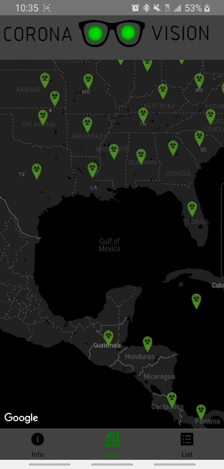

# CoronaVision
<h3>App to track cases, deaths, and recoveries of COVID-19 (currently deprecated)</h3>

 

<h3>Developed With: </h3>

<ul>
 <li>React-Native</li>
 <li>John Hopkins Coronavirus Data</li>
</ul>

<h3>Note: The getVirusStats() function needs to be improved due to the nature of how I scraped the john hopkins coronavirus dataL</h4>
